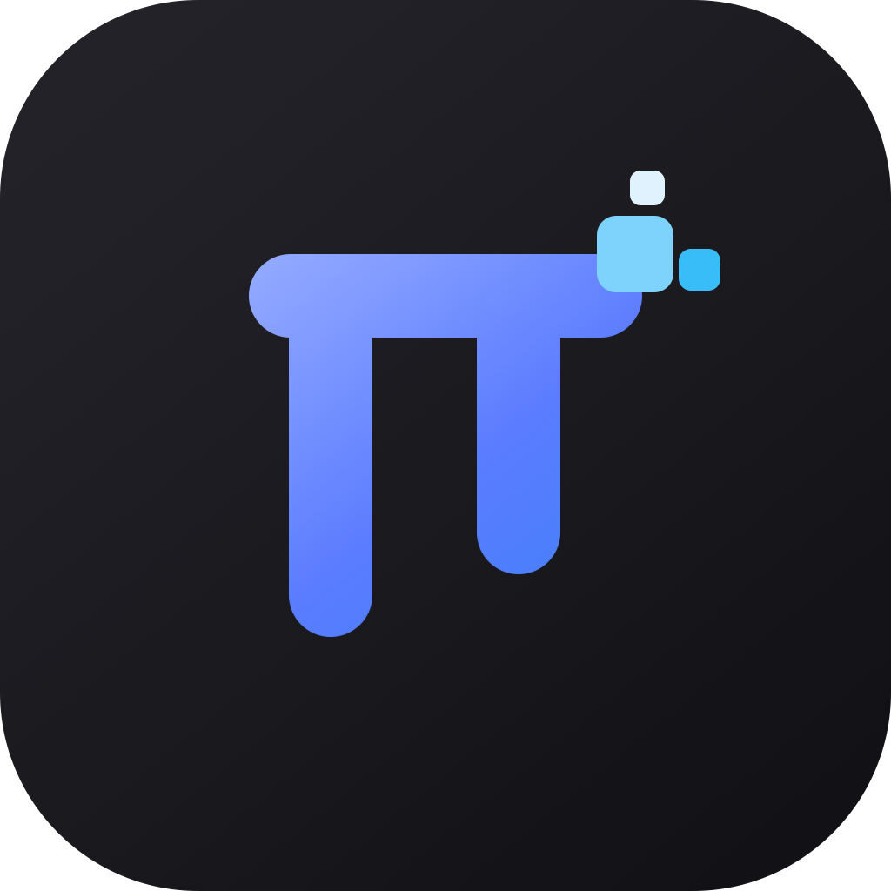

# Pix

<p align="left">
  
</p>

Pix is a desktop shell for the [pi](https://pi.dev) coding agent: a Codex-style UI that keeps configuration, packages, sessions, and tools on the native pi side (`~/.pi/agent`).

## Requirements

- Node.js 22.19 or newer
- pnpm 11.15.1

## Setup

```bash
pnpm install
pnpm electron:install
```

`electron:install` downloads the Electron 43 runtime for your platform.

## Develop

```bash
pnpm dev
```

Builds renderer / preload / main / agent-host, then launches Electron. Restart after source changes.

Product launch uses your real `HOME` and the same agent dir as the CLI (`~/.pi/agent` / `PI_CODING_AGENT_DIR`). Models, API keys, settings, packages, and tools match interactive `pi`. The last workspace is restored from desktop prefs; no temp workspace is created on every start.

## Validate

```bash
vp check
pnpm test
pnpm build
pnpm smoke
```

Isolated smoke (temp home + fixture workspace + fake model):

```bash
pnpm smoke
# or
PIX_M0_ISOLATED=1 pnpm start
```

Packaged smoke (unsigned app directory):

```bash
pnpm package
pnpm smoke:packaged
```

## Package

```bash
pnpm package
```

Produces an unsigned platform app directory under `apps/desktop/release/m0/` via `electron-builder --dir`.

## CI

GitHub Actions (`.github/workflows/ci.yml`) runs on every push and pull request across **Linux, Windows, and macOS**:

1. `pnpm install --frozen-lockfile`
2. `vp check`
3. `pnpm test`
4. `pnpm build`
5. `pnpm package`

Package outputs are uploaded as workflow artifacts (14-day retention). mac builds disable code-signing discovery so CI does not need Developer ID secrets.

## Architecture

```text
React Renderer → Preload → Electron Main → utilityProcess Agent Host → pi SDK
```

- Renderer has no Node.js access.
- Main supervises the Agent Host but does not execute pi tools or extensions.
- Agent Host uses the public `@earendil-works/pi-coding-agent` SDK.
- Electron `userData` is only for desktop chrome prefs — never a second agent config layer.
- A fresh pi home receives no Pix packages, resources, or custom settings.
- `utilityProcess` provides crash isolation, not a security sandbox.

## License

See [LICENSE](./LICENSE).
